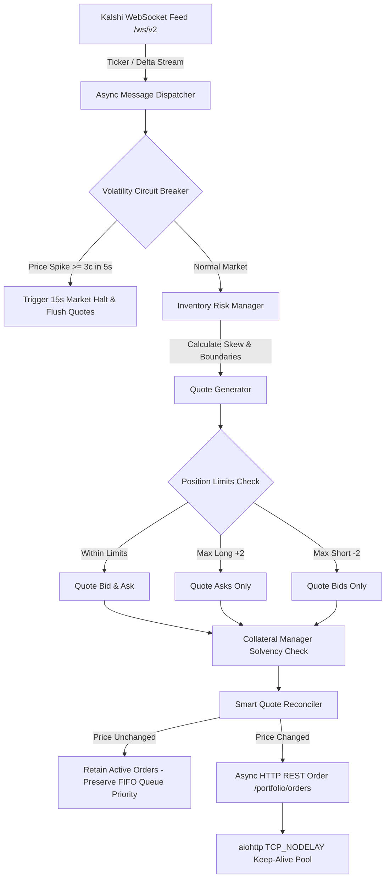

# Kalshi Automated Market Making & Prediction Trading Engine

A high-performance, institutional-grade Python algorithmic trading bot built for the **Kalshi Central Limit Order Book (CLOB)**. The bot is designed for sub-millisecond market making, low-risk liquidity provision, inventory skewing, volatility flash-crash protection, and mispricing arbitrage.

---

## 📌 Executive Summary & Architecture

The bot connects directly to Kalshi's Exchange APIs via high-speed WebSockets and asynchronous HTTP/2 client connections. It is engineered with safety-first risk controls tailored for small-to-institutional bankrolls, ensuring strict solvency, position limits, and Price-Time (FIFO) queue priority.



---

## 📂 Repository Structure

```text
Kalshi-bot-CPlus/
├── README.md                      # Root project overview (this file)
└── kelshi/                        # Core Python Application Directory
    ├── README.md                  # Comprehensive AI & developer context guide
    ├── market_making_core.py      # Zero-external-dependency MM core algorithms & risk engine
    ├── fast_main_remote.py        # Asynchronous WebSocket HFT trading bot (AWS/Cloud optimized)
    ├── fast_main.py               # Local/standard async WebSocket trading bot
    ├── kalshi_api.py              # Kalshi API v2 client (RSA & Ed25519 signing, REST endpoints)
    ├── strategies.py              # REST polling strategies (MarketMaker, Arbitrageur)
    ├── main.py                    # Polling loop runner for REST strategies
    ├── config.py                  # Environment config, credentials, single-instance socket locks
    ├── test_market_making_core.py # 37-case unit, black-swan & solvency test suite
    ├── aws_setup.md               # AWS deployment instructions (EC2, SNS, Systemd)
    └── requirements.txt           # Python dependencies
```

---

## ⚡ Key Highlights & Core Mechanisms

1. **Price-Time (FIFO) Queue Priority Preservation**:
   * On financial exchanges, canceling and replacing orders resets your priority to the back of the queue.
   * The engine checks active resting quotes against newly calculated target quotes. If the price hasn't moved, the order is **retained**, allowing the bot to work its way to the front of the queue.
2. **Volatility Circuit Breaker (Falling Knife / Flash-Crash Defense)**:
   * Tracks rolling mid-price history across a 5-second sliding window.
   * A $\ge 3¢$ jump or drop triggers an immediate 15-second quoting halt on that ticker and clears resting orders.
3. **Inventory Skewing & One-Sided Quoting**:
   * Skews pricing down when net long and up when net short.
   * At `+MAX_POSITION` ($+2$), bidding is disabled; only asks are quoted to offload inventory.
   * At `-MAX_POSITION` ($-2$), asking is disabled; only bids are quoted to cover.
4. **Strict Solvency & Collateral Management**:
   * Enforces 100% margin requirements locally before transmitting orders (`bid_price` for buy YES, `100 - ask_price` for sell YES).

---

## 🚀 Quick Start

### 1. Installation
```bash
cd kelshi
pip install -r requirements.txt
```

### 2. Environment Setup
Configure your `.env` in the `kelshi/` directory:
```ini
KALSHI_API_KEY_ID="your-api-key-id"
KALSHI_PRIVATE_KEY="-----BEGIN RSA/ED25519 PRIVATE KEY-----\n..."
TRADE_ENV="paper_prod"   # Options: prod, paper_prod, demo
ODDS_API_KEY="your-odds-api-key" # Optional (for external sports arbitrage)
```

### 3. Run Test Suite
```bash
python test_market_making_core.py
```

### 4. Launch High-Frequency Trading Bot
```bash
python fast_main_remote.py
```

---

## 🤖 AI Context & Future Usage Notice
To minimize token consumption and avoid re-reading the entire codebase on subsequent prompts, consult [`kelshi/README.md`](file:///c:/Users/arjun/OneDrive/Desktop/Projects/Kalshi-bot-CPlus/kelshi/README.md) for detailed per-file interfaces, constraints, and architecture invariants.
